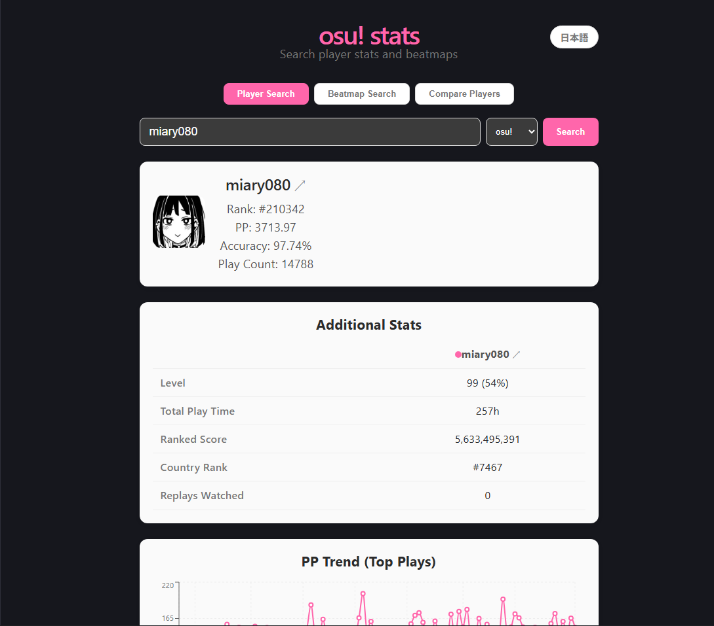

# osu! stats

osu! の公式APIを使って、プレイヤーの統計情報(ランク、pp、精度)とトッププレイを検索・表示するWebアプリです。

## デモ🔗 
https://osu-stats-app.vercel.app/


## 使用技術

- **フロントエンド**: React, Vite
- **バックエンド**: FastAPI (Python)
- **API**: [osu! API v2](https://osu.ppy.sh/docs/index.html)(Client Credentials Grant)

## 機能

- osu! ユーザー名でプレイヤーを検索
- プロフィール統計の表示(グローバルランク、pp、精度、プレイ回数)
- ゲームモード切り替え(osu!, Taiko, Catch, Mania)
- トッププレイ(ベストスコア)一覧の表示

## セットアップ

### 前提条件

- Python 3.10+
- Node.js 18+
- [osu! OAuthアプリ](https://osu.ppy.sh/home/account/edit#oauth) の登録(Client ID / Client Secretが必要)

### バックエンド

```bash
cd backend
cp .env.example .env
# .env を編集して OSU_CLIENT_ID と OSU_CLIENT_SECRET を設定

pip install -r requirements.txt
uvicorn main:app --reload --port 8000
```

### フロントエンド

```bash
cd frontend
npm install
npm run dev
```

ブラウザで `http://localhost:5173` を開いてください。

## API エンドポイント

| メソッド | パス | 説明 |
|---|---|---|
| GET | `/api/user/{username}` | ユーザーの統計情報を取得 |
| GET | `/api/user/{username}/scores/best` | ユーザーのトッププレイを取得 |

## 今後追加したい機能

- [ ] ビートマップ検索
- [ ] ユーザー比較機能
- [ ] pp推移のグラフ表示
- [ ] お気に入りプレイヤーの保存

## ライセンス

MIT